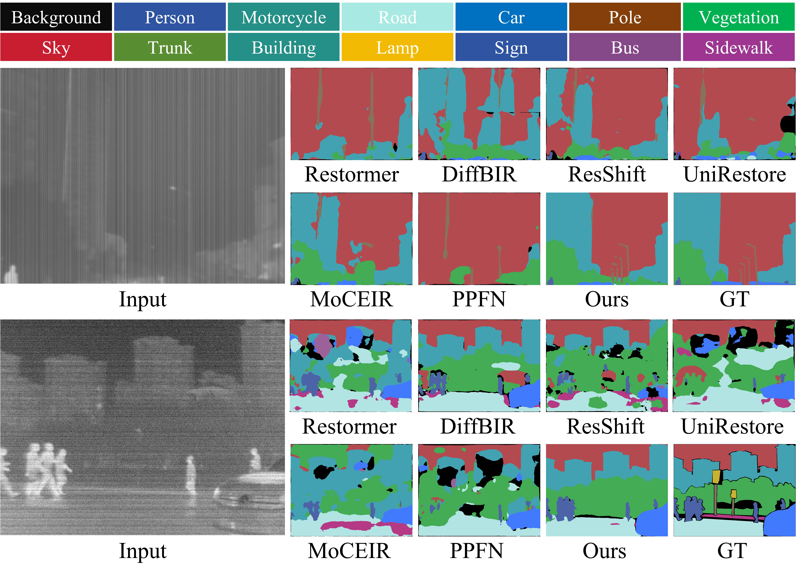

<h2 align="center">Taming Generative Diffusion Model for Task-Oriented Infrared Imaging</h2>

<div align="center">
  <a href="#">Tengyu Ma, 
  <a href="#">Zhilong Dai, 
  <a href="#">Yubo Diao, 
  <a href="#">Guanming An, 
  <a href="#">Long Ma, 
  <a href="#">Jinyuan Liu, 
  <a href="#">Risheng Liu</a><sup></sup>
  <br>
  School of Software Technology, Dalian University of Technology<br>
</div>


:fire: Accepted by CVPR 2026 !

:star: If InfraredIR is helpful for you, please help star this repo. Thanks!


## :book: Table Of Contents

- [TODO](#todo)
- [Abstract](#abstract)
- [Framework Overview](#overview)
- [Visual Comparison](#comparison)
- [Setup](#setup)
- [Train](#train)
- [Inference](#inference)

<!-- - [Installation](#installation)
- [Inference](#inference) -->


## <a id="todo"></a>:hourglass: TODO

- [x] Release Code :computer:
- [x] Release Checkpoints :link:

## <a id="abstract"></a>:fireworks: Abstract

> Infrared imaging is essential for perception in harsh environments. However, dynamically coupled degradation factors severely impair visual quality and downstream semantic accuracy. Although generative diffusion models provide strong image restoration priors, high computational cost and physical inconsistency limit their application in infrared sensing. To bridge these gaps, we reformulate infrared imaging as a single-step diffusion process, aligning degraded observations with trajectory latent states via dynamic timestep estimation to leverage timestep-specific diffusion priors for high-fidelity reconstruction. Meanwhile, we introduce a spectral regularization term to enforce thermal radiation constraints and ensure physical consistency. Subsequently, a task-aware low-rank adaptation mechanism is devised through dynamic prompting to enable efficient transfer across downstream infrared tasks. Experiments demonstrate our method surpasses existing approaches in restoration quality, semantic structure preservation, and task generalization.

## <a id="overview"></a> :eyes: Framework Overview


:star: Overview of the Task-Oriented Infrared Imaging Framework. The core architecture (top) enables single-step diffusion by integrating two dynamic conditioning mechanisms. Dynamic Timestep Estimation (bottom left) localizes each degraded input to its optimal position along the diffusion trajectory to leverage rich time-dependent priors. Task-Aware Low-Rank Adaptation (bottom right) combines a shared low-rank basis with task-specific modulation from dynamic prompting, enabling efficient adaptation to unseen tasks through prompt-only optimization.

## <a id="comparison"></a>:chart_with_upwards_trend: Visual Comparison

### Enhancemnt Results


### Detection Results


### Segmentation Results


### Small Target Detection Results


<!-- </details> -->

## <a id="setup"></a> ⚙️ Setup
```bash
conda create -n InfraredIR python=3.10
conda activate InfraredIR
pip install torch==2.8.0 torchvision --index-url https://download.pytorch.org/whl/cu128
pip install -r requirements.txt
```
Or use the conda env file that contains all the required dependencies.

```bash
conda env create -f environment.yaml
```


## <a id="train"></a> :fire: Train

We provide multiple training strategies to accommodate different vision tasks.

- Option 1: Single Specific Task Training
- Option 2: Multi-task Training
- Option 3: Unseen Task Fine-tuning

Please download the corresponding datasets and checkpoints according to your task requirements.

### :wrench: Prepare data

- Infrared Image Enhancement: [HM-TIR](https://github.com/Zihang-Chen/HM-TIR)
- Object Detection: [M<sup>3</sup>FD](https://github.com/JinyuanLiu-CV/TarDAL)
- Semantic Segmentation: [FMB](https://github.com/JinyuanLiu-CV/SegMiF)
- Infrared Small Target Detection: [SIRST3](https://github.com/XinyiYing/LESPS) (composed of NUAA-SIRST, NUDT-SIRST and IRSTD-1K)
- Real-world Infrared Image Enhancement: [TNO](https://figshare.com/articles/dataset/TNO_Image_Fusion_Dataset/1008029) and [RoadScene](https://figshare.com/articles/dataset/TNO_Image_Fusion_Dataset/1008029)

Regarding the division of the dataset, you can refer to `train.txt` and `val.txt/test.txt` under different datasets.

### :hammer: Prepare checkpoints

- Object Detection: [YOLOv8 checkpoint](https://drive.google.com/drive/folders/15V9K-_mgv54FLYDsiMdqafDdPkAFYQCt?usp=sharing) that we have fine-tuned on the M<sup>3</sup>FD dataset.
- Semantic Segmentation: [SegFormer checkpoint](https://drive.google.com/drive/folders/1spGJsgOaTfi-EHqKRh_8a2jomlLhKiLa?usp=sharing).
- Infrared Small Target Detection: [SCTransNet checkpoint](https://drive.google.com/drive/folders/1sliSTd03ITFP2Q20KKxSqSTnvxUsWlIJ?usp=sharing).

### :one: Single Specific Task Training

Taking `Infrared Image Enhancement` as an example

1. Download the pre-trained [SD-Turbo](https://huggingface.co/stabilityai/sd-turbo) model, or you can also download it online in our code.

2. Download [HM-TIR](https://github.com/Zihang-Chen/HM-TIR) training set and modify the paths in `configs/train_STAGE1_single.yaml`.
Our code can generate degraded images online based on GT.  
(If you prefer paired LQ–GT inputs, you can generate LQ images offline using `src/my_utils/degradation.py`, and modify the `degradation_synthetic` parameter in the `yaml` configuration.)

1. Complete the paths in `run_train_stage1_single.sh`, then run

```bash
sh run_train_stage1_single.sh
```


### :two: Multi-task Training

1. Modify `task_list` and `task_weights` in the `configs/train_STAGE1_multi.yaml` to specify the training tasks and their sampling probabilities during training iterations.

```yaml
task_list: ['enhancement', 'detection', 'segmentation']

task_weights:
  enhancement: 0.2
  detection: 0.4
  segmentation: 0.4
```

&emsp;The above setting means that each iteration samples enhancement, detection, and segmentation data with probabilities of 0.2, 0.4, and 0.4, respectively.

&emsp;You can freely adjust these parameters according to your task requirements.

2. Modify the tasks dataset paths in the `configs/train_STAGE1_multi.yaml`, including both training and validation datasets.

3. Complete the checkpoint paths in `run_train_stage1_multi.sh`, then run

```bash
sh run_train_stage1_multi.sh
```


### :three: Unseen Task Fine-tuning

1. Modify `task_list` and `task_weights` in the `configs/train_STAGE2.yaml`
   
2. Modify the tasks dataset paths in the `configs/train_STAGE2.yaml`

3. Complete the checkpoint paths in `run_train_stage2.sh`, (You additionally need to specify the `pretrained_path` parameter to indicate the checkpoint path for fine-tuning), then run

```bash
sh run_train_stage2.sh
```

## <a id="inference"></a> :rocket: Inference

> [!IMPORTANT]
> **The pre-trained weights can be downloaded from [InfraredIR](https://drive.google.com/drive/folders/1tA3qLK71B2a-Ht2_nFCL4pinYY8tAFrX?usp=drive_link).**

### <a name="enhancement"></a> :whale: Infrared Image Enhancement
1. For the infrared image enhancement task, you need:
    + Set `task_type: 'enhancement'` in `configs/test.yaml`.
    + Complete LQ image path `validation.lq_path` in `configs/test.yaml`.

2. Download our pre-trained checkpoint.

3. Complete the paths in `run_inference.sh`, then run

```bash
sh run_inference.sh
```
### :dolphin: Other Downstream Tasks
For other downstream tasks, we do not provide end-to-end scripts for better visual quality. You need to first follow the [Infrared Image Enhancement](#enhancement) inference pipeline to generate enhanced images, and then use them as input for downstream models.

Similarly, when generating enhanced images, you need to set the `task_type` value in `configs/test.yaml` according to different tasks.

The downstream task scripts are provided as follows:

#### :tiger: Object Detection

```
python nets/Yolov8/eval_yolo.py \
    --weights [yolo weights path] \
    --input_dir [image path] \
    --gt_label_dir [corresponding label path] \
    --save_dir [output folder]
```

#### :lion: Semantic Segmentation


```
python -m nets.segformer.test \
    --checkpoint [segformer weights path] \
    --input_dir [image path] \
    --gt_dir [label path] \
    --output_dir [output folder]
```

#### :frog: Infrared Small Target Detection

Refer to `nets/SCTransNet/split_sirst3.py` for the SIRST3 test set splitting.

```
python -m nets.SCTransNet.test \
    --weight_pth [SCTransNet weights path] \
    --dataset_dir [image path] \
    --gt_dir [SIRST3 folder path] \
    --dataset_names [NUAA-SIRST | NUDT-SIRST | IRSTD-1K] \
    --save_img_dir [output folder] \
    --save_log [output log folder]
```


## :triangular_flag_on_post: Citation
If you use our code and dataset for research, please cite our paper:

```bibtex
@InProceedings{Ma_2026_CVPR,
    author    = {Ma, Tengyu and Dai, Zhilong and Diao, Yubo and An, Guanming and Ma, Long and Liu, Jinyuan and Liu, Risheng},
    title     = {Taming Generative Diffusion Model for Task-Oriented Infrared Imaging},
    booktitle = {Proceedings of the IEEE/CVF Conference on Computer Vision and Pattern Recognition (CVPR)},
    month     = {June},
    year      = {2026},
    pages     = {30843-30853}
}
```

## :notebook: License

This project is released under the [Apache 2.0 license](LICENSE).


## :mailbox_with_mail: Contacts 
If you have any questions or suggestions about this repo, please feel free to contact me (tyma0913@gmail.com).